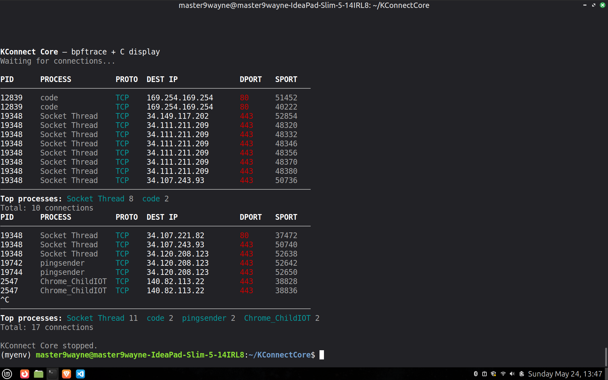

# KConnect-Core
## IET Systems SMP Final Boss
### Deadline is 7th July
Mihika Chaudhari 

251ee134

I did it on ubuntu terminal.

* Kudos to all of you for making it so far.
* But now is the time for the final project implementation.
* The kernel side eBPF C code has been given, go through it and write the corresponding bpftrace script. 
* Your output should look something like this:
 
* Fork this repo, and start getting your hands dirty.
#### Execution Instructions:
* Compile the display program: `gcc -o kconnectcore kconnectcore.c`
* Run the pipeline: `sudo bpftrace kconnectcore.bt | ./kconnectcore`

  
#### Best of Luck !!!!
